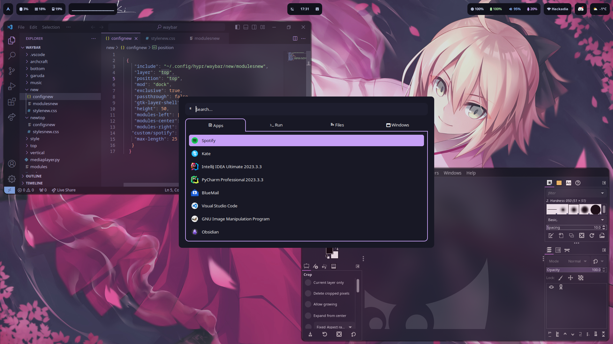

# Dotfiles Install

```
git clone https://github.com/AhmetinzmSec/Hyprland-DotFiles-v2.3.git
```

```cd Hyprland-DotFiles-v2.3```

Run the install file (Beta): `./Install.sh`

or install it manually:


Let's start with a backup. To receive using a terminal:

```
cp -r ~/.config ~/.config.bak
cp -r ~/.icons ~/.icons.bak
cp -r ~/.fonts ~/.fonts.bak
cp -r ~/.themes ~/.themes.bak
cp -r ~/.zshrc ~/.zshrc.bak
cp -r ~/.aliases ~/.aliases.bak
```

Or take a manual backup:


- Don't lose your configuration:

Go to the `/home/user/` directory and copy the `.config` folder and paste it without leaving the same directory. Change the name of the pasted folder to `.config.bak`


- Don't lose your icons:

Go to the `/home/user/` directory and copy the `.icons` folder and paste it without leaving the same directory. Change the name of the pasted folder to `.icons.bak`


- Don't lose your fonts:

Go to the `/home/user/` directory and copy the `.fonts` folder and paste it without leaving the same directory. Change the name of the pasted folder to `.fonts.bak`


- Don't lose your themes:

Go to the `/home/user/` directory and copy the `.themes` folder and paste it without leaving the same directory. Change the name of the pasted folder to `.themes.bak`


Now let's back up our files:


- Don't lose your ZSH configuration:

Go to the `/home/user/` directory and copy and paste the `.zshrc` file without leaving the same directory. Change the name of the pasted file to `.zshrc.bak`


- Aliases are a file specially prepared for me. Most likely you do not have this file. If so, follow this step:

Go to the `/home/user/` directory and copy and paste the `.aliases` file without leaving the same directory. Change the name of the pasted file to `.aliases.bak`


Pay attention to the file and folder names I wrote. If the name of your configuration files is not currently written, you do not have any previous configuration. You don't need to make backups for these.

For example, I have a file named `.aliases`. This file does not have to be available to everyone. You don't need to force a backup for this.


# Required Softwares

Let's install our software:

```
[Arch Linux]
yay -S nm-connection-editor nwg-darwer cava mpd mpv vlc sway tmux hyprland waybar grimblast sddm brightnessctl playerctl swaylock-effects pamixer rofi rofi-emoji rofi-power-menu wf-recorder btop zsh oh-my-zsh-powerline-theme-git ark unrar zip unzip pavucontrol xdg-desktop-portal-wlr neovim vim nano git wget swaybg dunst dolphin kvantum kate appimagelauncher-bin noto-fonts-emoji wl-clipboard xfce4-appfinder wofi catfish firefox kitty polkit-gnome gnome-keyring ntfs-3g cliphist qt5ct qt5 plasma lxappearance tesseract-data-tur tesseract-data-eng tesseract-data-rus visual-studio-code-bin spicetify-cli jdk-openjdk discord bitwarden flatpak gimp kitty kdenlive inkscape konsole neofetch github-desktop-bin webapp-manager steam virt-manager qemu-desktop dnsmasq iptables-nft go yarn npm nodejs python-pip hyprpicker syncthing spotify obsidian qbittorrent obs-studio lutris portmaster-stub-bin paru-bin
```

# Optional Softwares

```
[All Distros]
flatpak install stremio flatseal obsproject atom
```

# Change Flatpak Apps Theme

```
sudo flatpak override --filesystem=$HOME/.themes
sudo flatpak override --filesystem=$HOME/.icons
sudo flatpak override --env=GTK_THEME=Catppuccin-Mocha-Mauve-GTK
sudo flatpak override --env=ICON_THEME=Dracula
```

# Change System Theme

- This process is required to activate qt5ct in the system and to apply the GTK Theme. We can start editing the environment side by typing the command `sudo nano /etc/environment`

```
...
GTK_THEME=Catppuccin-Mocha-Mauve-GTK
QT_QPA_PLATFORMTHEME=qt5ct
...
```

# Change Plasma Theme

This method is required for our friends who will use KDE Plasma applications to use a fully compatible theme. Those who are not obsessed with the theme can skip this step.

Now let's install the KDE Plasma theme. Catppuccin Theme is not officially available in the Plasma store. I left the theme in the `.themes` folder for you. However, I leave the official GitHub repo for you. You can apply the specified path on both sides

Please note that you must first download the KDE Plasma desktop environment and log in to KDE.

- Let's Apply Plasma Catppuccin Theme:

```
cd ~/.themes/catppuccin-kde
```

or

```
git clone https://github.com/catppuccin/kde.git

cd kde
```

The next step is the same for both methods.

```./install.sh```

After the script runs, it will offer you options. Respectively:

Modern Icons (1),
Mocha (4),
Mauve (1)

make your choices. And finally it will ask you if you want to apply the theme. Specify that you want to apply the theme

- Let's Change SDDM Theme

I am sharing the real repo of SDDM Theme with you. Please download from the official repo to respect the effort:

```
git clone https://github.com/keyitdev/sddm-astronaut-theme.git

sudo cp -r sddm-astronaut-theme/ /usr/share/themes/

echo "[Theme]
Current=sddm-astronaut-theme
CursorTheme=Adwaita" | sudo tee /etc/sddm.conf

```

- Change GRUB Theme

```
sudo cp -r GRUB Theme/cyber/* /usr/share/grub/themes

sudo nano /etc/default/grub
```

Add Line
```
GRUB_THEME="/usr/share/grub/themes/theme.txt"
```

Save and exit and run command:

```
sudo grub-mkconfig -o /boot/grub/grub.cfg
```

# Change Shell

```
sudo chsh -s $(which zsh)
chsh -s $(which zsh)
```


# Spicetify Config

- Authorization Settings

```
sudo chmod a+wr /opt/spotify

sudo chmod a+wr /opt/spotify/Apps -R
```

- Backup Apply Enable Devtools

```
spicetify backup apply enable-devtools
```

- Apply Theme

```
 spicetify config current_theme Bloom color_scheme dark
 spicetify config inject_css 1 replace_colors 1 overwrite_assets 1 inject_theme_js 1
 spicetify apply
```

# Screenshot Desktop



# Screenshot Spotify


